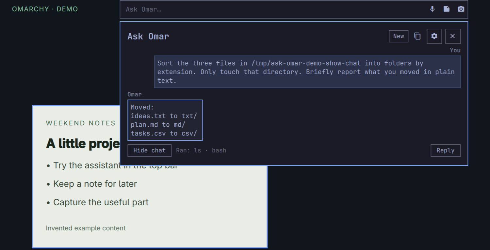
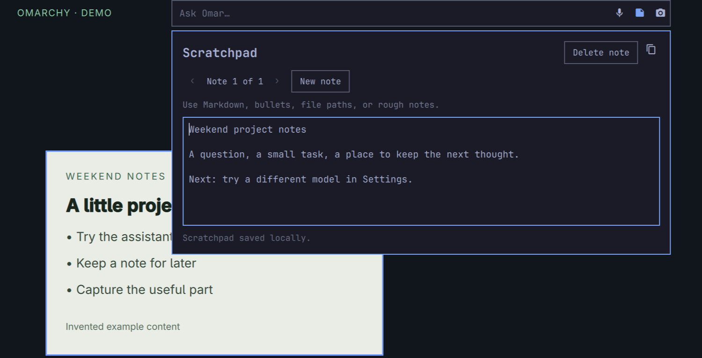
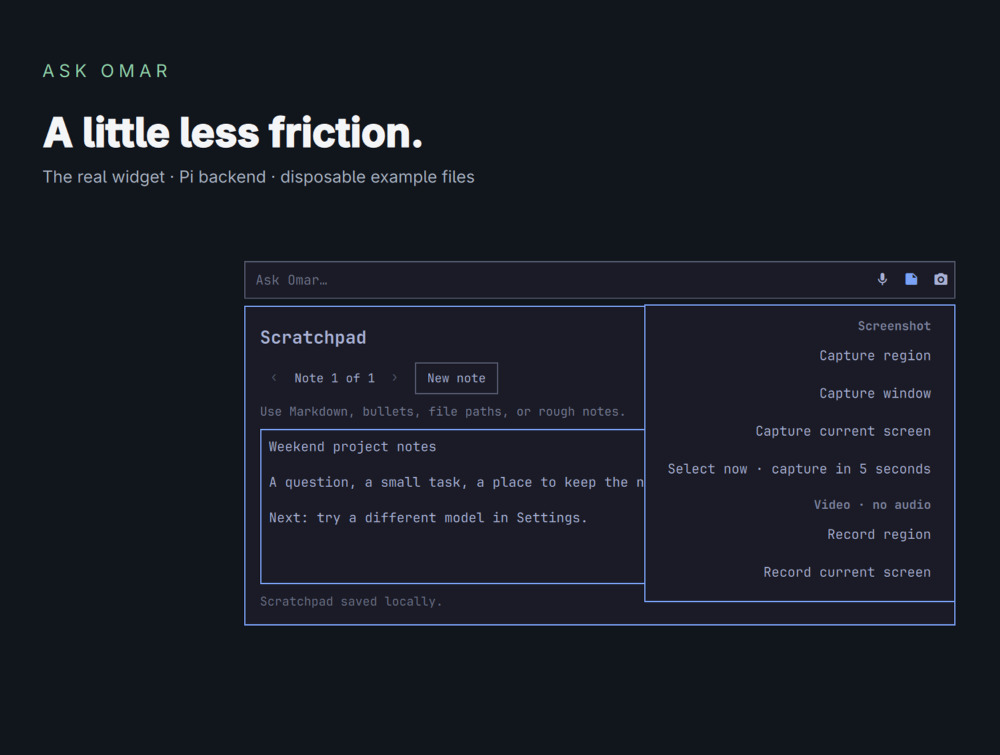

# Ask Omar

**An AI assistant in your Omarchy top menubar.**

Type a question in the top bar. Answers and follow-ups open in a panel beneath it; notes, capture and optional dictation are a click away. Ask Omar stays part of your desktop, without another terminal to open. Built for Omarchy, powered by [Pi](https://pi.dev).

**Experimental 0.1.1.** Runs with your user permissions. **Ask First** shows shell commands before they run and can grant access for one request; this is still not a sandbox. Agent requests need Pi and a connected model provider; notes and capture do not.



[Watch the demo](https://aboutme.md/ask-omar) · [Releases](https://github.com/chrisjskelton/ask-omar/releases) · [Security](SECURITY.md)

## What it does

- **Ask, then follow up.** Get help with Omarchy or ask the agent to carry out a desktop task. Follow-ups share a conversation until **New**, a restart, or the next request after 30 idle minutes.
- **Keep a Scratchpad.** Local notes for paths, prompts and half-written thoughts. Notes are not automatically added to AI prompts.
- **Capture and dictate.** Screenshot/recording shortcuts put a file path on your clipboard or attach a screenshot to a note. Optional [Voxtype](https://voxtype.io) dictation makes a draft; you choose when to send it.
- **Revisit answers.** Read recent questions and answers in Settings. Opening a saved answer does not restart that conversation.

Try “What's the shortcut to move a window to workspace 2?” or a bounded task such as “Sort the example files in this folder by type.” The agent can use `read`, `grep`, `find`, `ls` and `bash`. Results and available actions depend on your model and installed tools.

## Requirements

This is for **Omarchy Quattro (4.x), with its Quickshell plugin system**. The release was tested locally with Omarchy **4.0.3-1**, Pi **0.85.1**, Python **3.14.7** and Node **26.8.1**. Other combinations are not yet certified.

- Python **3.11+**, Node with native TypeScript support (CI uses **22.18.0**), `make` and `git`.
- Omarchy's shell, plugin commands and capture/notification helpers; a working systemd user session.
- `wl-copy`, `jq`, `grim` and the capture dependencies supplied by Omarchy. Voxtype is optional.
- For AI: install Pi separately and connect a provider inside Pi. Ask Omar does not install Pi, provide a login flow or store separate provider credentials. Model use follows your provider's access and pricing.

The installer checks dependencies before changing files. It does not request root or change packaged Omarchy files.

## Install

Read the permissions below first, then clone and inspect the release:

```bash
git clone --branch v0.1.1 https://github.com/chrisjskelton/ask-omar.git
cd ask-omar
make install
```

This installs user-owned files, enables the companion user service, adds the widget and restarts the Omarchy shell to load it. Your existing Ask Omar configuration is preserved.

For AI requests, run `pi`, use `/login` to connect your provider, then:

```bash
ask-omar setup
omarchy-shell ask-omar open
```

First setup uses Pi's default provider/model, or the first model Pi lists. You can choose another in Settings. Don't paste passwords, tokens or sign-in codes into Omar.

### Omarchy plugin installer / marketplace

The repository contains a root plugin manifest. Omarchy can install the widget with:

```bash
omarchy plugin add https://github.com/chrisjskelton/ask-omar.git --enable
```

**One manual step is required:** the widget needs its Python companion service. Installing or enabling the widget never runs a setup script automatically. From the installed checkout:

```bash
cd "${XDG_CONFIG_HOME:-$HOME/.config}/omarchy/plugins/ask-omar.assistant"
make setup
```

Then run `ask-omar setup`. A marketplace listing is discovery, not a security certification. The plugin ID remains `ask-omar.assistant` for existing installations.

## Permissions and the guard

Omar runs as you. It can read your files, run programs and use the network. A task may request administrator access; whether that works depends on your host's authentication and privilege policy.

Pi's native Bash tool is disabled. Model-generated commands can run only through Ask Omar's command broker. The default **Ask First** mode shows the exact command with **Allow once**, **Allow for this question**, and **Deny**. A question grant lasts only until Omar finishes, the request is stopped, or 15 minutes pass. Some known catastrophic patterns are blocked without an override. Pi's direct `read`, `grep`, `find` and `ls` tools remain automatic so ordinary inspection does not become a wall of prompts.

Settings also offers **Block Commands**, which disables Omar's shell command tool, and **Allow All**, which runs shell commands without asking. Allow All requires a second click to enable and remains visibly selected; mandatory catastrophic blocks remain active, but this is not a sandbox or a security mode. Commands are limited to 60 seconds and 64 KiB of captured output. Stop cancels the active task, but **does not undo actions already completed**.

Ask First's pattern checks hard-block a narrow set of catastrophic actions and explain recognised risks. They do not isolate the agent from files or credentials that direct tools can read, and approved commands run with your user permissions. Other processes running as your user share access to local state and the service. Review commands as carefully as you would in a terminal; this release is not intended for unattended sensitive workloads.

## Privacy and retention

No Ask Omar telemetry is implemented. Notes, drafts and recent answers are stored locally. Notes and captures are not automatically attached to requests. Your requests and any context the agent reads for the task may be sent through Pi to your chosen provider. Explicit web searches open Google; opened sites and commands can use the network. Provider-side retention is governed by your provider and account settings.

| Data | Retention |
|---|---|
| Recent questions and answers | Up to the newest 100 by default, within a 10 MiB shared state-file limit. Older answers are removed first to preserve notes and drafts. Clear in Settings, or set `[history] limit = 0` to disable storage. |
| Draft | Up to 2,000 characters; expires when read after 24 hours. |
| Scratchpad | Up to 20 notes of 20,000 characters each. Over-limit saves are rejected visibly. |
| Attached screenshots | Private local copies. Removing a note does not remove its attachment files. |
| Original captures | Stay in Omarchy's capture location. |
| Conversation context | In Pi memory; the next request after 30 idle minutes starts fresh. |
| Agent log | Private local stderr log, trimmed at startup. |

State is in `${XDG_STATE_HOME:-~/.local/state}/ask-omar`; configuration is in `${XDG_CONFIG_HOME:-~/.config}/ask-omar`. Local data is protected by user permissions, not encrypted by Ask Omar. Clipboard managers may retain copied content. Answers are displayed as plain text so remote images in model output are not automatically loaded.

## Update and remove

For a release checkout, inspect the new release notes, fetch its tag, check it out, then run `make install` again. For the marketplace route, update the plugin through Omarchy, then run `make setup` again from its installed directory to update the companion service too.

```bash
make uninstall
```

Uninstall removes the widget, service and launchers. It preserves Pi, its sign-ins, and your Ask Omar configuration/state. To **permanently delete Ask Omar's saved data** after uninstalling:

```bash
rm -rf -- "${XDG_CONFIG_HOME:-$HOME/.config}/ask-omar" \
  "${XDG_STATE_HOME:-$HOME/.local/state}/ask-omar"
```

Remove original captures separately if wanted. Local deletion does not erase provider-side data or clipboard history. If you set `ASK_OMAR_CONFIG`, manage that custom config file separately.

## Troubleshooting

- **Widget says backend missing:** run `make setup` from its installed checkout, then `ask-omar setup`.
- **Pi missing or disconnected:** install Pi, sign in within `pi` using `/login`, and rerun `ask-omar setup`.
- **Service problem:** run `systemctl --user status ask-omar.service` and `journalctl --user -u ask-omar.service -n 40`. Inspect logs for private content before sharing.
- **No mic:** install and configure Omarchy Dictation/Voxtype. The mic is optional.
- **Save error:** keep the editor open, correct the length or storage problem and retry. Don't discard unsaved text.
- **Model setting problem:** choose a model Pi lists. Pi's auth/RPC interface must support the flags used by this release.

## How it fits together

```text
Omarchy widget → local CLI → private Unix socket → Python user service → Pi → provider
                                             ↘ local notes and history
```

The Python service uses the standard library. Pi provides the agent loop and provider integration. Omarchy provides the desktop and capture tools; Voxtype provides optional dictation.

## Why I built it

I got hooked on Omarchy while moving over from macOS. Ask Omar began as a small place in the top bar to ask how the desktop worked. Through daily use it grew into a home for the quick questions, notes and captures I carry between agent sessions.

I still use Pi in a terminal for longer sessions. Omar is for the small desktop jobs I want to start without opening one.

This is a personal project and it will keep changing. [Issues and contributions](CONTRIBUTING.md) are welcome. See the [roadmap](docs/ROADMAP.md) for ideas that are not yet implemented.

## Gallery




MIT licensed. Built on Omarchy, Pi and Voxtype; no affiliation or endorsement implied.
