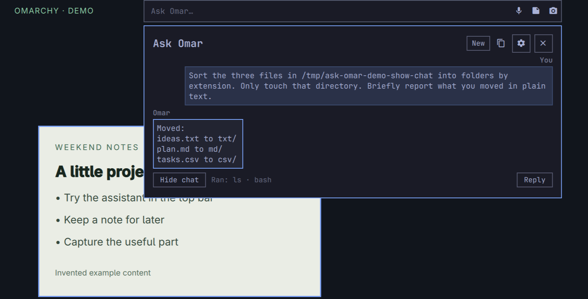
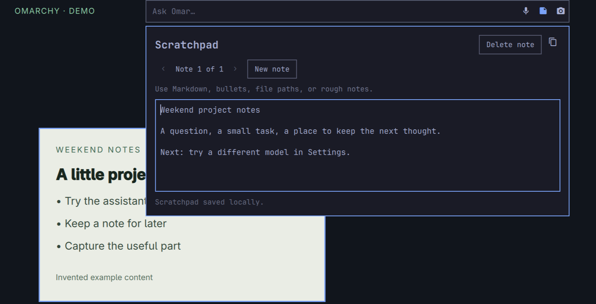
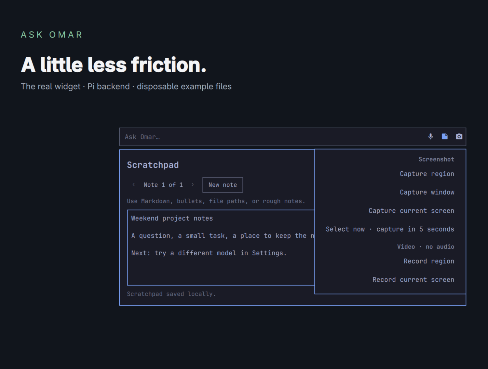

# Ask Omar

**An AI assistant in your Omarchy top bar.**

Type a question in the top bar. Answers and follow-ups open in a panel beneath it; notes, capture and optional dictation are a click away. Built for Omarchy, powered by [Pi](https://pi.dev).

Ask Omar runs with your user permissions and isn't a sandbox. By default, **Ask First** shows every shell command before it runs. AI requests need Pi and a connected provider; notes, capture and dictation don't.



[Product page](https://aboutme.md/ask-omar) · [Releases](https://github.com/chrisjskelton/ask-omar/releases) · [Security](SECURITY.md)

## What it does

- **Ask, then follow up.** Get help with Omarchy or ask Omar to carry out a small desktop task. Follow-ups share one conversation until you press **New**, change the model or safety mode, restart the service, or come back after 30 idle minutes.
- **Keep a Scratchpad.** Local notes for paths, prompts and half-written thoughts. Notes aren't sent with your questions; paste in anything you want Omar to see.
- **Capture and dictate.** Take a screenshot or recording from the bar. Omar copies the file path, or adds a screenshot to Scratchpad. With optional [Voxtype](https://voxtype.io), tap the mic to dictate or hold it while you talk; you choose when to send.
- **Revisit answers.** Recent questions and answers are in Settings → Past answers. Opening one doesn't reopen that conversation.

Try “What's the shortcut to move a window to workspace 2?” or a small task such as “Sort the files in ~/ask-omar-demo into folders by type.” Omar can read and search your files and, with the access you choose, run shell commands, starting in your home folder. Results depend on your model and installed tools.

Requests that ask for a Google or web search, such as “google Hyprland gaps” or “search the web for Omarchy themes”, open Google in your browser instead of going to the AI. “open https://…” opens that link directly.

## What Pi does

Pi does the AI work. You install Pi and sign in to your provider there; Ask Omar doesn't handle or store that sign-in. Ask Omar starts Pi in the background with a fixed set of tools: it can read and search your files, and it runs shell commands only through Ask Omar's safety modes. Pi's own Bash tool is off. Your own Pi extensions, skills and context files aren't loaded, and Pi runs without a saved session, so the conversation lives only in memory.

## Requirements

This is for **Omarchy Quattro (4.x), with its Quickshell plugin system**. It was tested with Omarchy **4.0.3-1**, Pi **0.85.1**, Python **3.14.7** and Node **26.8.1**. Other combinations are not yet certified.

- Python **3.11+**, Node with native TypeScript support (**22.18+**), `make` and `git`.
- Omarchy's shell, plugin commands and capture/notification helpers; a working systemd user session.
- `wl-copy`, `jq`, `grim` and the capture dependencies supplied by Omarchy. Voxtype is optional.
- For AI: install Pi separately and connect a provider inside Pi. Model use follows your provider's access and pricing.

Setup checks dependencies before changing files. It doesn't request root or change packaged Omarchy files.

## Install

Read [Permissions and the guard](#permissions-and-the-guard) first. Ask Omar installs from GitHub with Omarchy's plugin manager, whether or not you found it through the marketplace:

```bash
omarchy plugin add https://github.com/chrisjskelton/ask-omar.git --yes
```

This clones and validates the widget but leaves it disabled. Pin the checkout to the release commit, set up the background service, then enable the widget:

```bash
cd "${XDG_CONFIG_HOME:-$HOME/.config}/omarchy/plugins/ask-omar.assistant"
# Copy the full 40-character commit from the latest release notes:
ASK_OMAR_COMMIT=<full 40-character commit>
git -c advice.detachedHead=false checkout --detach "$ASK_OMAR_COMMIT"
make setup ASK_OMAR_COMMIT="$ASK_OMAR_COMMIT"
omarchy plugin enable ask-omar.assistant
```

Use the full commit, not a tag or short hash. `make setup` checks that exact commit and a clean checkout, runs the tests, then installs the background service and launchers. An existing Ask Omar configuration is kept.

For AI requests, run `pi`, use `/login` to connect your provider, then:

```bash
ask-omar setup
omarchy-shell ask-omar open
```

First setup uses Pi's default model, or the first one Pi lists. You can choose another in Settings. Don't paste passwords, tokens or sign-in codes into Omar.

A marketplace listing is discovery, not a security certification.

### Moving from an older clone install

Before 0.1.4, Ask Omar could also be installed with `git clone` and `make install`, which copied the widget into Omarchy's plugin folder. To switch, run `make uninstall` in that clone (your settings and notes are kept), then follow the steps above. You can delete the old clone afterwards.

## Permissions and the guard

Omar runs as you. It can read your files, run programs and use the network. Whether a task can get administrator access depends on your system's authentication and privilege policy.

Pi's own Bash tool is off, so the AI can run shell commands only through Ask Omar's command tool. Pi's `read`, `grep`, `find` and `ls` tools never ask first, in any mode, so Omar can read any file you can.

Choose a mode in Settings → Safety:

| Mode | What happens |
|---|---|
| **Ask First** (default) | Every command is shown before it runs. Choose **Allow once**, **Allow for 15 minutes** or **Deny**. The 15-minute option covers routine commands in later requests; it ends early on New, a safety-mode change, the idle reset or a service restart. |
| **Ask for Recognized Risks** | Routine commands run without being shown. Omar asks only about commands it recognizes as high-risk. |
| **Block Commands** | No shell commands. Omar can still read and search your files. |
| **Always Allow — Dangerous** | Every command runs without asking, including destructive ones. It needs a separate confirmation in Settings. |

An approval request that isn't answered within 90 seconds is cancelled. Commands stop after 60 seconds or 64 KiB of output, and can be up to 32 KiB long. Stop cancels the current task, but **doesn't undo anything already done**.

**The high-risk check is a warning, not a lock.** Except in Always Allow, Omar asks again before commands that match known risky patterns: recursive forced deletion (`rm -rf`), disk and partition tools, low-level overwrites, recursive permission or ownership changes, privilege elevation, host-connected containers, power controls, downloaded code piped into a shell, fork bombs, and attempts to lower Ask Omar's own safety setting. A command can do the same things in ways the patterns don't catch, for example by running a script. Only Ask First, without an active 15-minute grant, shows you every command. Review commands as carefully as you would in a terminal; this isn't meant for unattended sensitive work.

## Privacy and retention

No Ask Omar telemetry is implemented. Notes, drafts and recent answers are stored locally. Notes and captures aren't attached to requests. Your requests and any context Omar reads for a task may be sent through Pi to your chosen provider. Web searches open Google; opened sites and commands can use the network. Provider-side retention is governed by your provider and account settings.

| Data | Retention |
|---|---|
| Recent questions and answers | Up to the newest 100 by default, within a 10 MiB shared state-file limit. Older answers are removed first to preserve notes and drafts. Clear in Settings, or set `[history] limit = 0` to disable storage. |
| Draft | Up to 2,000 characters; expires when read after 24 hours. |
| Scratchpad | Up to 20 notes of 20,000 characters each. Over-limit saves are rejected visibly. |
| Attached screenshots | Private local copies. Removing a note does not remove its attachment files. |
| Original captures | Stay in Omarchy's capture location. |
| Conversation context | In Pi memory; the next request after 30 idle minutes starts fresh. |
| Agent log | Private local stderr log, trimmed at startup. |

State is in `${XDG_STATE_HOME:-~/.local/state}/ask-omar`; configuration is in `${XDG_CONFIG_HOME:-~/.config}/ask-omar`. If the saved-state file can't be read, Ask Omar keeps it as `state.json.unreadable-…`, starts with empty notes, and says so in Scratchpad. Local data is protected by user permissions, not encrypted by Ask Omar. Clipboard managers may retain copied content. Answers are displayed as plain text so remote images in model output are not automatically loaded.

## Update and remove

Read the new release notes and use their full commit:

```bash
cd "${XDG_CONFIG_HOME:-$HOME/.config}/omarchy/plugins/ask-omar.assistant"
git fetch origin
ASK_OMAR_COMMIT=<full 40-character commit from the release notes>
git -c advice.detachedHead=false checkout --detach "$ASK_OMAR_COMMIT"
make setup ASK_OMAR_COMMIT="$ASK_OMAR_COMMIT"
```

`omarchy plugin update` updates the widget but not the background service. If you use it, Ask Omar shows “Finish updating Ask Omar” until you run `make setup` as above.

To remove Ask Omar:

```bash
cd "${XDG_CONFIG_HOME:-$HOME/.config}/omarchy/plugins/ask-omar.assistant"
make uninstall
omarchy plugin remove ask-omar.assistant
```

`make uninstall` removes the service and launchers and disables the widget; `omarchy plugin remove` deletes the widget folder. Pi, its sign-ins, and your Ask Omar configuration and notes are kept. To **permanently delete Ask Omar's saved data** afterwards:

```bash
rm -rf -- "${XDG_CONFIG_HOME:-$HOME/.config}/ask-omar" \
  "${XDG_STATE_HOME:-$HOME/.local/state}/ask-omar"
```

Remove original captures separately if wanted. Local deletion does not erase provider-side data or clipboard history. If you set `ASK_OMAR_CONFIG`, manage that custom config file separately.

## Troubleshooting

- **Checkout verification fails:** copy the full 40-character commit from the release notes, run `git -c advice.detachedHead=false checkout --detach "$ASK_OMAR_COMMIT"` in the plugin folder, and remove or preserve any local changes before retrying `make setup ASK_OMAR_COMMIT="$ASK_OMAR_COMMIT"`.
- **Widget says backend missing, or “Finish updating Ask Omar”:** in the plugin folder, check out the release commit as above, run `make setup ASK_OMAR_COMMIT="$ASK_OMAR_COMMIT"`, then `ask-omar setup`.
- **`omarchy plugin add` says the plugin is already installed:** an older copied widget is still there. See [Moving from an older clone install](#moving-from-an-older-clone-install).
- **Pi missing or disconnected:** install Pi, sign in within `pi` using `/login`, and rerun `ask-omar setup`.
- **Service problem:** run `systemctl --user status ask-omar.service` and `journalctl --user -u ask-omar.service -n 40`. Inspect logs for private content before sharing.
- **No mic:** install and configure Omarchy Dictation/Voxtype. The mic is optional.
- **Save error:** keep the editor open, correct the length or storage problem and retry. Don't discard unsaved text.
- **Model setting problem:** choose a model Pi lists. Pi's auth/RPC interface must support the flags used by this release.

## How it fits together

```text
Omarchy widget → ask-omar CLI → private Unix socket → Python user service → Pi → provider
                                                 ↘ local notes and history
```

The Python service uses the standard library. Pi provides the agent loop and provider integration. Omarchy provides the desktop and capture tools; Voxtype provides optional dictation.

## Why I built it

I got hooked on Omarchy while moving over from macOS. Ask Omar began as a small place in the top bar to ask how the desktop worked. Through daily use it grew into a home for the quick questions, notes and captures I carry between agent sessions.

I still use Pi in a terminal for longer sessions. Omar is for the small desktop jobs I want to start without opening one.

This is a personal project and it will keep changing. [Issues and contributions](CONTRIBUTING.md) are welcome. See the [roadmap](docs/ROADMAP.md) for ideas that are not yet implemented.

## Gallery




MIT licensed. Built on Omarchy, Pi and Voxtype; no affiliation or endorsement implied.
